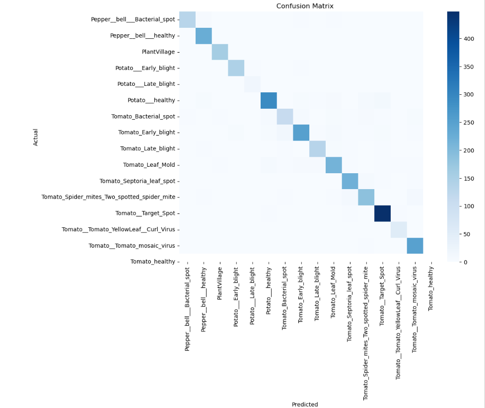
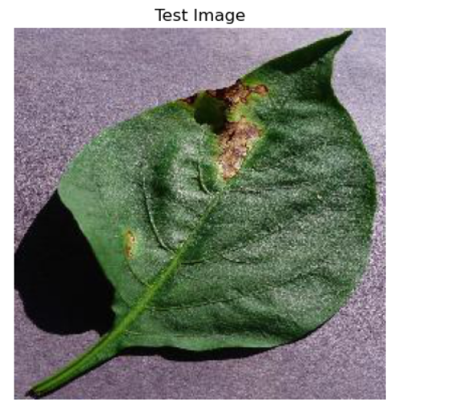

# 🌿 Plant Disease Detection using Deep Learning


---

This project leverages Deep Learning techniques to classify plant diseases from leaf images. It uses a pretrained **EfficientNet-B0** architecture fine-tuned on the PlantVillage dataset to achieve high accuracy in multi-class classification.

The system includes full pipeline development, including data loading, model training, evaluation, visualization, and inference, making it suitable for real-world agricultural applications.

This repository also includes training logs, evaluation metrics, and visualization outputs such as accuracy curves and a confusion matrix for better interpretability.

---

# Key Features

* **Custom Dataset Loader**
  Handles multi-class image datasets with preprocessing and transformations.
* **Transfer Learning (EfficientNet-B0)**
  Uses pretrained weights and fine-tunes deeper layers for high performance.
* **Layer Freezing Strategy**
  Freezes early layers and trains deeper layers to improve generalization.
* **Learning Rate Scheduler**
  Dynamically adjusts learning rate for better convergence.
* **Performance Metrics**
  Confusion matrix
  Classification report
  Training curves for loss, accuracy, and learning rate
* **Inference:** Predicts diseases from unseen images and provides confidence scores for top-3 predictions.
---
# Dataset
The project utilizes the **PlantVillage dataset**, which contains images of healthy and diseased plant leaves across multiple classes. The dataset structure is expected as follows:
## Dataset Structure

```
/root_dir
   ├── Class_1
   │       ├── img1.jpg
   │       ├── img2.jpg
   │       └── ...
   ├── Class_2
   │       ├── img1.jpg
   │       ├── img2.jpg
   │       └── ...
   └── ...
Update the root_dir in the code to the location of your dataset.
---

# ⚙️ Requirements
Install the following Python libraries before running the code:
```bash
pip install torch torchvision numpy pillow scikit-learn matplotlib seaborn opencv-python
```

---

# Code Structure Overview

## 1. Dataset Preparation
### Class: `CustomImageDataset`
    * Responsible for loading images from the dataset.
    * Applies transformations (e.g., resizing, normalization).
    * Maps class names to corresponding indices for model compatibility.

## 2. EfficientNet-B0 Architecture
### Class: `EfficientNetB0Classifier`
Defines a pretrained EfficientNet-B0-based deep learning model for image classification:
**Feature Extractor (EfficientNet-B0 Backbone):**
Uses a lightweight yet powerful pretrained CNN (EfficientNet-B0) to extract rich hierarchical image features efficiently.
**Transfer Learning:**
Leverages pretrained weights trained on ImageNet to improve performance and reduce training time.
**Adaptive Pooling Layer:**
Converts feature maps into a fixed-size representation regardless of input image size.
**Dropout Layer:**
Reduces overfitting by randomly deactivating neurons during training.
**Fully Connected Layer:**
Maps extracted features to output class probabilities for final disease classification.
**Softmax Activation (optional depending on implementation):**
Converts logits into probability scores for each class.

## 3️. Training
### Function: `train_model`
Trains the EfficientNet-B0 model using a specified image dataset.
  * Utilizes pretrained EfficientNet-B0 backbone for transfer learning
  * Fine-tunes the model on the plant disease classification dataset
  * Saves the best model weights based on validation accuracy
  * Uses cross-entropy loss for multi-class classification

## 4. Evaluation
### Function: `evaluate_model`
Evaluates the trained EfficientNet-B0 model on the test dataset to measure its performance.
Generates:
   * Detailed Classification Report
   * Includes precision, recall, F1-score, and support for each class to analyze model performance in detail.
   * Confusion Matrix
   * Visualizes correct and incorrect predictions across all classes, helping to understand model behavior and misclassifications.

---
## Grad-CAM Visualization

### Function: `visualize_grad_cam`

Uses **Grad-CAM (Gradient-weighted Class Activation Mapping)** to:

* Highlight important regions of an image influencing the model's predictions  
* Provide insights into the model's decision-making process  
* Improve interpretability by visualizing where the model focuses while making predictions
---
## Inference

### Function: `predict_disease`

Predicts labels for unseen images using the trained EfficientNet-B0 model.

* Takes input of new/unseen plant leaf images  
* Processes the image through the trained model for classification  
* Displays **Top-3 class probabilities** for better interpretability  
* Helps in understanding model confidence across multiple classes

---
## Training Metrics

### Visualization of Training Progress
Graphs show trends in:

- 📉 Loss (Training & Validation)  
- 📊 Accuracy (Training & Validation)  
- 📈 Learning Rate Progression  

---
### Example Metrics Analysis

#### Loss Curves
- Steady decrease in both training and validation loss  
- Indicates effective learning and optimization  

#### Accuracy Curves
- Achieves over **90% accuracy**  
- Minimal overfitting observed  
- Training and validation metrics remain closely aligned throughout  

# 📊 Confusion Matrix



---

# 🧪 Prediction Example



**Output:**

```
Predicted Disease: Tomato Bacterial Spot
Confidence: 99%+
```

-
